# Measuring On-Chain Impact of RetroPGF Season 7: An Exploratory Causal Analysis


*An open exploration of causal inference methods applied to Optimism funding data*


---


## TL;DR

Three top-funded DEX projects from Optimism's RetroPGF Season 7 (Uniswap, Aerodrome, Velodrome — representing ~$870K in funding) were analyzed using Bayesian causal inference. This approach was used to detect whether funding caused measurable increases in on-chain transaction activity.

**Key Findings:**
- **No statistically significant effects detected** across any of the three projects (p-values: 0.20-0.36)
- **Estimated effects ranged from -0.3% to +9.1%**, but all with high uncertainty
- **Models showed good historical fit** (R² = 0.89-0.99) but struggled with post-funding predictions
- **Severe autocorrelation issues** suggest models didn't capture time-related patterns adequately

**Why the inconclusive results?**
Likely due to: crypto market volatility, insufficient counterfactual variables, short observation windows (8-month pre-period, 4-month post-period), and the reality that funding impacts may take longer to materialize than measured.


**What this doesn't mean:** That funding had no impact or was wasted.

**What this does mean:** With current methods, data, and timeframes, any signal is indistinguishable from noise. The analysis reveals what we need to measure impact better: longer time horizons, richer counterfactuals, and metrics beyond transaction counts.


**Methodological Note:**
This study took a **bottom-up approach**, analyzing each project individually before assessing aggregate impact. However, this approach has systematic limitations: it doesn't scale well (requires manual research per project), and as more projects get funded over time, we risk running out of good unfunded counterfactuals. Alternative **top-down approaches** (aggregating all funded projects into a single analysis) could address these issues and remain an important direction for future exploration.

**Why share this?**
This work is part of a broader research initiative to advance impact measurement for public goods funding. All code, data, and methodology are shared openly to invite feedback, collaboration, and collective learning about what works (and what doesn't) in measuring retroactive funding effectiveness.


---


## Introduction


This study forms part of an ongoing effort to understand the on-chain effects of public goods funding on Optimism, exploring whether measurable impacts could be detected among the top-funded projects in Season 7. The Superchain and the Optimism Collective were chosen as the focus due to their pioneering role in funding experiments and their influence on many other Web3 funding programs. This work continues a broader initiative aimed at advancing retrospective funding mechanisms toward recurrent, concurrent, and ROI-positive systems, as outlined in [Toward Recurrent and Concurrent Grants Rounds in Web3](https://mirror.xyz/stefipereira.eth/SNXPcTKTO88BGgctU_eJw5_N_q6Tw23q4ed1zGBdCHo).


**Initial Research Questions:**
- Can we find clear signals that funding causes direct positive growth of activity on funded projects ( increase in transactions)?
- Is the investment in these projects ROI-positive — meaning, does the additional transaction volume generated (multiplied by the Superchain sequencer fees) exceed the amount of funding received? (The operational cost of running the round is not included in this ROI calculation.)


A Bayesian Structural Time Series (BSTS) model via TensorFlow Probability's CausalImpact package was used to estimate what might have happened.


**Important disclaimer and assumptions:**
- This analysis was conducted approximately one month after the end of Season 7. The impact of funding may have lagging effects that have not yet fully materialized or may take additional time to manifest in on-chain activity.
- The count of transactions is used as the primary metric for growth. Gas fees were not used, as they could introduce additional noise to the analysis due to significant changes following the Duncan upgrade during the analysis period.
- The “treatment” date is defined as the date on which each project first received funding. The amounts received were not included as variables in the models.
- Only decentralized exchanges (DEXs) were included in the analysis for practical reasons, as their control counterfactuals could be applied consistently across all projects.

The analysis is exploratory and aims to test the feasibility and limits of using time-series causal analysis in the volatile crypto environment. The results are inconclusive, but the process reveals important insights about what we need to measure impact effectively.


---


## Methodology Overview


### Approach


The general workflow consisted of:


1. **Project Selection**: Identified top-funded projects in Season 7 based on funding amounts and frequency
2. **Data Collection**: Gathered daily transaction counts for funded projects and potential counterfactual variables
3. **Counterfactual Selection**: Identified correlated time series that could predict the funded project's behavior absent treatment
4. **Causal Impact Framework**: Applied BSTS models ( tfp-causalImpact) to estimate the counterfactual and measure deviations post-funding
5. **Data Transformations**: Tested multiple transformations (Box-Cox, log, differencing, Anscombe) to stabilize variance
6. **Model Diagnostics**: Examined residuals, autocorrelation, predictive power, and parameter stability


### What are "Counterfactuals"?


In causal inference, a **counterfactual** represents what would have happened if the intervention (funding) had not occurred. Since we can't observe both realities simultaneously, we build a synthetic control using:
- **Similar protocols** (other DEXs that weren't funded at the same time ( Curve, Balancer..))
- **Ecosystem metrics** (overall chain activity on Superchain chains)
- **Market conditions** (ETH price, market cap, trading volume)


The model learns the relationship between these predictors and the target project during the pre-funding period, then projects that relationship forward to estimate what would have happened post-funding without the intervention.


### Key Dates


- **Analysis Period Start**: August 1, 2023
- **Treatment Date (Funding)**: April 5, 2025  
- **Post-Treatment Start**: April 6, 2025
- **Analysis Period End**: July 31, 2025


---


## Data & Project Selection


### Project Selection Criteria


From the 866 grant recipients in the On-Chain Builders category, projects were filtered for those that received funding in all 6 funding distribution dates. All analyzed projects were DEXs. Since causal analysis requires a deep understanding of both the problem and the treatment, the selection focused on projects whose business models and roles within the ecosystem were familiar, and for which appropriate counterfactual projects could be identified.


This resulted in the top 5 funded projects. The analysis focused on three major DEXs.


1. **Uniswap** - Total funding: ~$296,250 USD
2. **Aerodrome Finance** - Total funding: ~$296,250 USD
3. **Velodrome** - Total funding: ~$277,138 USD


Total in funding analysed: 869.6M USD , ~14% of total distributed amount


### Funding Distribution

The analysis revealed high concentration in funding distribution:
- Mean funding per project: $6,861 USD
- Median funding: $1,475 USD
- Funding distribution followed a long-tail (power-law) pattern, with top projects receiving substantially higher amounts than the average recipient


### Metrics & Data Sources


**Primary Metric**: Daily transaction counts were collected for each funded project across all Superchain networks. Details about the data queries can be found in the `data/getting_data.ipynb` notebook, and the raw data used in the analysis is available in the `/data` folder.


Initially, gas fees collected were considered as the impact metric. However, the Dencun upgrade during the analysis period dramatically changed fee dynamics. Sequencer fees dropped to a tiny fraction of previous levels, making cross-period comparisons invalid. Transaction count became the most reliable proxy for protocol usage and impact.

# PAREI AQUI 

**Data Sources**:
- Project metrics: [Open Source Observer (OSO)](https://www.opensource.observer/)
- Counterfactual variables:
  - Similar DEXs: Curve, Balancer transaction counts (Used similar project that have not received funding to build the counterfactual series)
  - Chain activity: Base, Optimism, Unichain, Soneium transaction counts  
  - Market data: ETH price, market cap, volume (CoinGecko)
  - Ethereum mainnet: Transaction count


**Data Challenges**:
- Missing values for some counterfactual variables required interpolation
- Limited historical data for newer chains (Base, Unichain)
- Had to shorten analysis window from 2023-01-01 to 2023-08-01 due to data availability
- Ethereum price and market cap data are only available for up to one year prior to the query date. using this variable on the analysis force all the other series to be reduced to the same period, including gthe analysed data.
---


## Causal Impact Analysis


TFP CausalImpact was chosen for this analysis because transaction counts in crypto markets tend to be highly volatile and influenced by numerous external factors, making traditional time series models like SARIMA insufficient for causal inference. While autoregressive models can capture temporal patterns, they cannot account for exogenous variables or directly attribute observed changes to specific interventions such as funding events. In contrast, the Bayesian structural time series framework implemented in TFP CausalImpact incorporates covariates as regressors, enabling the model to control for confounding factors and estimate a robust counterfactual scenario. This approach provides a more reliable way to assess the true causal impact of funding on project activity.


A log base 10 transformation was tested and found to substantially reduce variance in the time series, improving data stability and enhancing the reliability of the subsequent correlation analysis by minimizing noise. Consequently, all analyses and models presented were conducted using the log-transformed data.

### 4.1 Uniswap Analysis


#### Counterfactual Variable Selection


**Correlation Analysis**


To build a robust counterfactual, correlations between Uniswap's daily transaction count and potential predictor variables were analyzed across three periods.


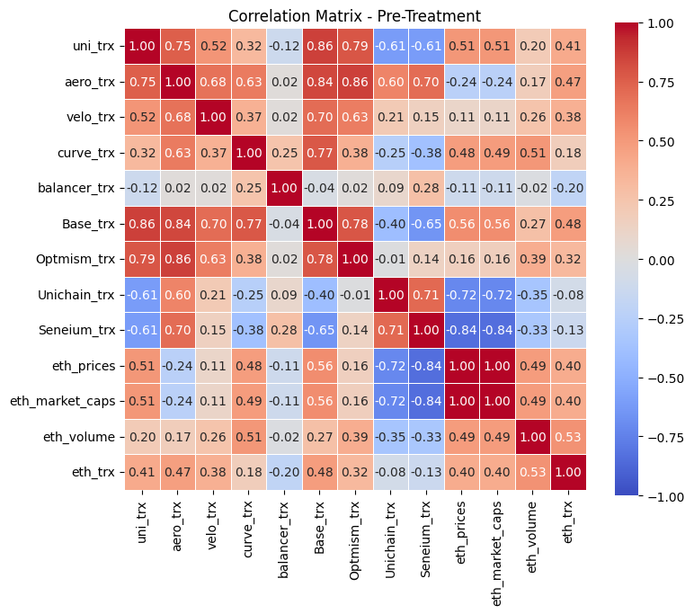

*Figure: Correlation matrix showing relationships between various metrics before treatment*


**Key Observations:**
- Base and Optimism chain activity showed strong pre-treatment correlations (>0.75)
- Correlations weakened post-treatment, suggesting structural changes, probably on the analysed series
- ETH market indicators showed more stable correlations


**Rolling Correlation Analysis**


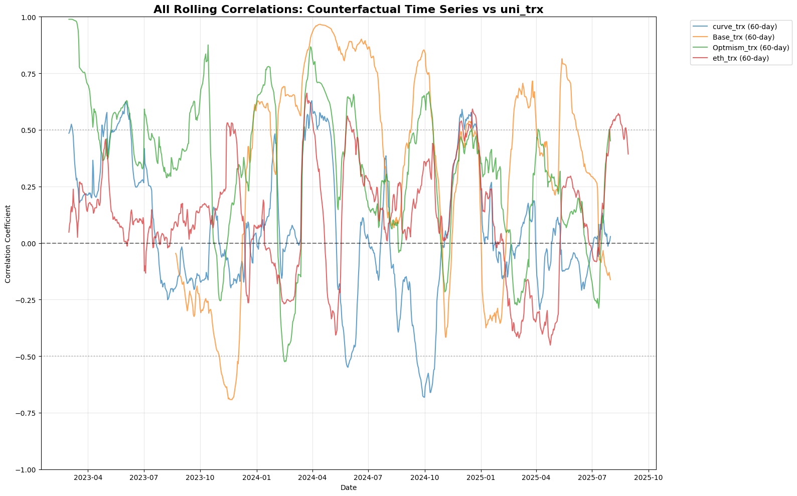

*Figure: 60-day rolling correlations between Uniswap transaction count and potential predictor variables over time*

To check stability over time, I computed rolling correlations (7-day, 30-day, 60-day windows). This revealed:
- Correlation strengths fluctuate significantly over time
- No single variable maintains consistently high correlation
- This instability poses challenges for accurate counterfactual prediction


**Final Counterfactual Variables Used:**
- Base chain daily transactions
- Optimism chain daily transactions  
- Ethereum mainnet daily transactions
- Curve Finance daily transactions


#### Initial Model Fit (Raw Data)


**Model Setup:**
- Pre-period: 2023-08-01 to 2025-04-05 (613 days)
- Post-period: 2025-04-06 to 2025-07-31 (117 days)
- Response: Uniswap daily transaction count
- Predictors: Base, Optimism, ETH, Curve transaction counts


**Results:**

## Causal Impact Analysis Results

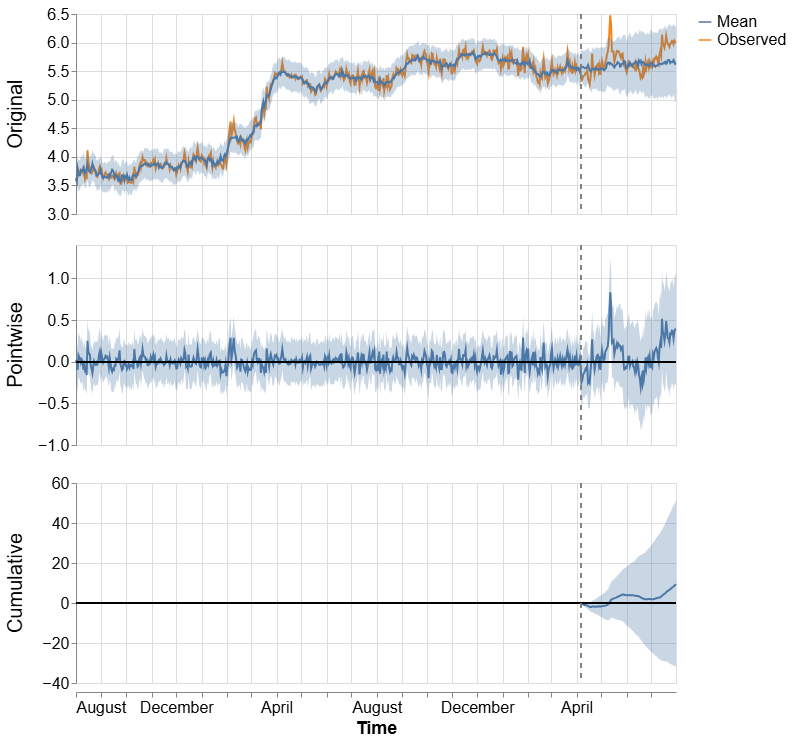

*Figure: Causal impact analysis showing observed vs predicted Uniswap transaction counts (log-transformed) with pointwise and cumulative effects*

```
Posterior Inference {CausalImpact}
                          Average            Cumulative
Actual                    5.7                665.3
Prediction (s.d.)         5.6 (0.19)         654.1 (22.08)
95% CI                    [5.2, 6.0]         [610.0, 698.4]

Absolute effect (s.d.)    0.1 (0.19)         11.3 (22.08)
95% CI                    [-0.3, 0.5]        [-33.0, 55.3]

Relative effect (s.d.)    1.8% (3.5%)        1.8% (3.0%)
95% CI                    [-4.7%, 9.1%]      [-4.7%, 9.1%]

Posterior tail-area probability p: 0.309
Posterior prob. of a causal effect: 69.15%
```


**Interpretation:**
- The observed average was 5.7 on log scale
- The model predicted 5.6 on log scale in absence of funding
- Estimated effect: +0.1 on log scale (+1.8%)
- **p-value: 0.309** - Not statistically significant
- The 95% confidence interval [-0.3, 0.5] includes negative effects, indicating high uncertainty
- Posterior probability of a causal effect: 69.15%
- Note: Since these values are on a logarithmic scale, the 1.8% relative effect represents the approximate percentage increase in the original metric


**Model Quality Metrics:**
- Pre-period RMSE: 0.070
- Pre-period R²: 0.99


The very high R² (0.99) indicates the counterfactual variables explain almost all of the pre-period variance, suggesting:
1. The model has excellent predictive power
2. The selected predictors capture the relevant patterns effectively
3. The low RMSE (0.070) further confirms the model's precision


#### Data Transformations & Model Refinement


Given potential non-normality in the data, multiple transformations were tested to stabilize variance in the pre-treatment period and improve model assumptions.


**1. Box-Cox Transformation**


Box-Cox transformation applies a power transformation to stabilize variance and make the data more normally distributed. Maximum likelihood estimation (MLE) was used to find optimal λ (lambda) parameters.


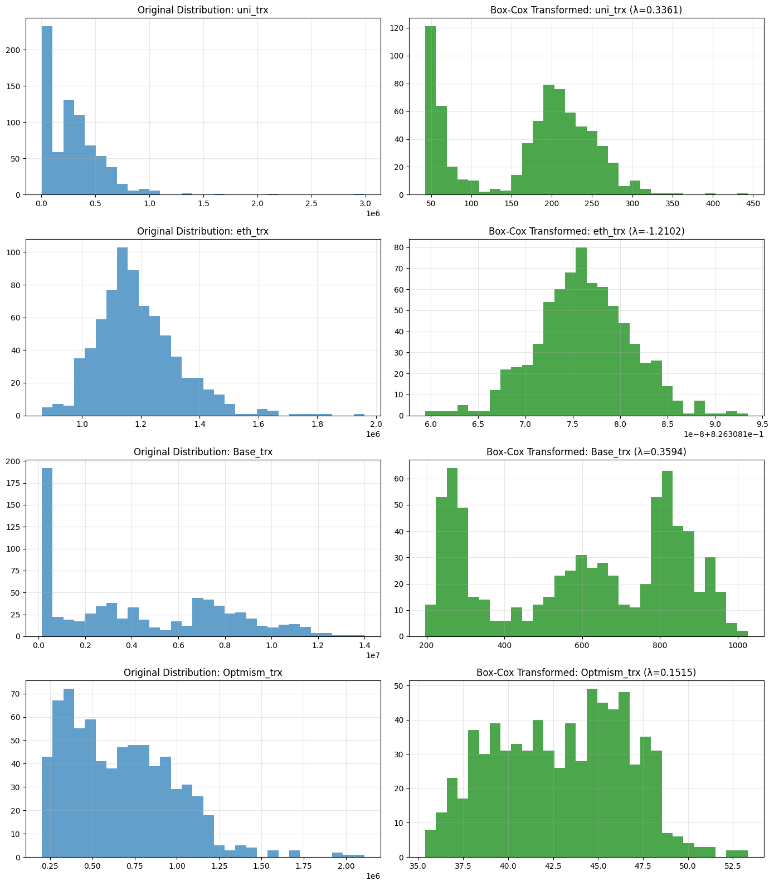

*Figure: Original distributions (left) and Box-Cox transformed distributions (right) for key variables*


| Variable | Optimal λ | Interpretation |
|----------|-----------|----------------|
| Uniswap transactions | 0.33 | Mild power transformation |
| Base transactions | 0.361 | Moderate power |
| Optimism transactions | 0.152 | Mild power |
| ETH transactions | -1.21 | Strong inverse transformation |


**Box-Cox Results:**


*Figure: Causal impact analysis using Box-Cox transformed data showing observed vs predicted Uniswap transaction counts with pointwise and cumulative effects*

```
Posterior Inference {CausalImpact}
                          Average            Cumulative
Actual                    243.3              28,468.5
Prediction (s.d.)         225.2 (21.62)      26,346.9 (2,529.9)
95% CI                    [182.6, 264.9]     [21,364.5, 30,993.2]


Absolute effect (s.d.)    18.1 (21.62)       2,121.5 (2,529.9)
95% CI                    [-21.6, 60.7]      [-2,524.7, 7,103.9]


Relative effect (s.d.)    9.1% (10.8%)       9.1% (11.0%)
95% CI                    [-8.1%, 33.3%]     [-8.1%, 33.3%]


Posterior tail-area probability p: 0.202
Posterior prob. of a causal effect: 79.80%
```


**Improvements:**
- P-value improved from 0.309 to 0.202
- Relative effect increased from 1.8% to 9.1%
- Posterior probability of causal effect increased from 69.15% to 79.80%
- Still not statistically significant (p > 0.05)


**2. Differencing Transformation**


First-order differencing removes trends and can stabilize mean:


```
Posterior Inference {CausalImpact}
                          Average            Cumulative
Actual                    243.3              28,468.5
Prediction (s.d.)         226.6 (22.02)      26,515.5 (2,576.71)
95% CI                    [184.3, 269.2]     [21,564.6, 31,500.7]


Absolute effect (s.d.)    16.7 (22.02)       1,952.9 (2,576.71)
95% CI                    [-25.9, 59.0]      [-3,032.3, 6,903.9]


Relative effect (s.d.)    8.4% (11.0%)       8.4% (11.0%)
95% CI                    [-9.6%, 32.0%]     [-9.6%, 32.0%]


Posterior tail-area probability p: 0.222
```


Similar uncertainty to Box-Cox, slight improvement over raw data.


**3. Anscombe + Differencing Combined**


The Anscombe transform (2√(x + 3/8)) stabilizes variance for count data:


```
Posterior Inference {CausalImpact}
                          Average            Cumulative
Actual                    7.1                834.2
Prediction (s.d.)         0.7 (13.83)        77.0 (1,617.84)
95% CI                    [-26.6, 26.5]      [-3,113.8, 3,097.9]


Absolute effect (s.d.)    6.5 (13.83)        757.1 (1,617.84)
95% CI                    [-19.3, 33.7]      [-2,263.7, 3,947.9]


Relative effect (s.d.)    -162.7% (1322.5%)  -162.7% (1322.0%)


Posterior tail-area probability p: 0.335
```


This transformation increased uncertainty significantly, suggesting it was not appropriate for this data structure.

Based on the Box-Cox transformation, it was applied to all subsequent analyses to stabilize variance and make the model residuals more normally distributed. This improved model fit and reduced uncertainty in the estimates, leading to more reliable results.

#### Model Diagnostics

**Residual Analysis (Box-Cox Model)**

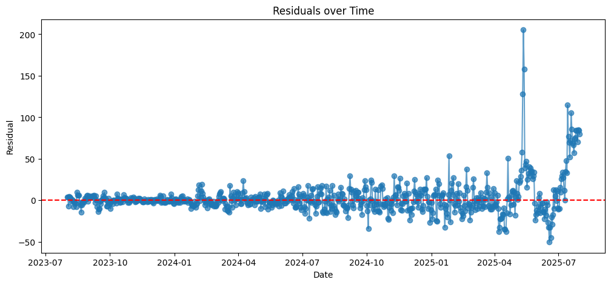

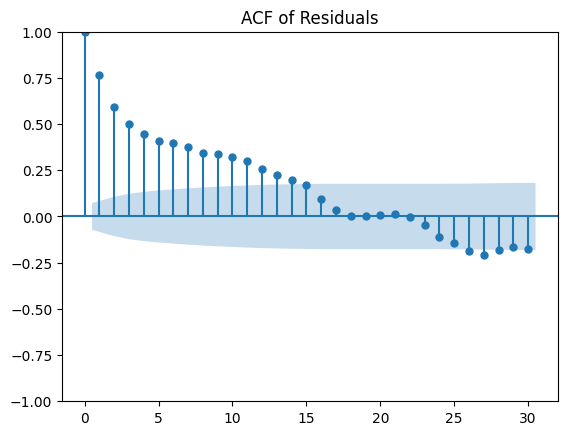

*Figure: Model diagnostics showing residuals over time (top) and autocorrelation function of residuals (bottom)*

* **Shapiro–Wilk test**: **statistic = 0.71, p < 0.0001**

  * **Purpose:** Checks whether residuals (model errors) follow a normal distribution.
  * **Interpretation:** Since the p-value is very small, we reject the normality assumption — the residuals are **not normally distributed**.

* **Durbin–Watson statistic**: **0.46**

  * **Purpose:** Tests whether consecutive residuals are correlated over time.
  * **Interpretation:** The ideal value is **around 2**, which indicates no autocorrelation.
  * A value of **0.46** shows **strong positive autocorrelation**, meaning the model is **not fully capturing the time-related structure** in the data.


**Pre-period vs Post-period Residuals:**

Pre-period:
- Shapiro-Wilk: 0.96, p<0.0001 (mild non-normality)
- Durbin-Watson: 1.36 (some autocorrelation)


Post-period:
- Shapiro-Wilk: 0.91, p<0.0001 (worse non-normality)
- Durbin-Watson: 0.25 (severe autocorrelation)


**Interpretation:**
The post-period shows worse model fit, with increased autocorrelation and deviation from normality. This suggests either:
- A structural break occurred (due to funding or other unmapped factors/predictors).
- The model is misspecified for the post-period
- External shocks affected the relationship between predictors and outcome.


**Beta Coefficients (Parameter Stability)**


Examining the posterior distributions of the regression weights (β coefficients) helps us understand how much each predictor contributes to explaining the variation in Uniswap’s transaction count — and whether these relationships remain stable over time. In simple terms, this test shows which variables matter most, how confident we are about their effect, and whether the model’s relationships are reliable.


| Predictor | Mean β | 95% CI | P(β>0) |
|-----------|--------|--------|--------|
| Base transactions | 0.323 | [0.241, 0.409] | 100% |
| Optimism transactions | 0.089 | [0.000, 0.141] | 94% |
| ETH transactions | 0.003 | [0.000, 0.074] | 5% |
| Curve transactions | 0.342 | [0.153, 0.496] | 100% |


**Key Findings:**

- Base and Curve transactions are strong predictors — their effects are clearly positive and consistent.

- Optimism transactions have moderate predictive power, contributing somewhat to the model but with higher uncertainty.

- ETH transactions add little new information, likely because their effect overlaps with other chain activity metrics.

- The wide confidence intervals across predictors indicate some instability, meaning the model’s parameter estimates might change depending on the period or data used.


---


### 4.2 Aerodrome Finance Analysis


Following the same methodology for Aerodrome Finance:


**Pre-treatment correlations Analysis:**

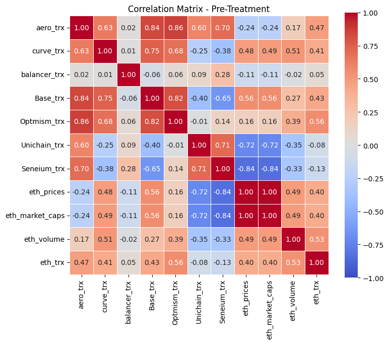

*Figure: Correlation matrix showing relationships between Aerodrome and various metrics before treatment*

- Curve: 0.63
- Base: 0.84
- Optimism: 0.86
- ETH transactions: 0.38

**Beta Coefficients (Initial Model Fit):**

| Predictor | Mean β | 95% CI | P(β>0) | P(β<0) |
|-----------|--------|--------|--------|--------|
| Curve transactions | 0.1632 | [0.0000, 0.2886] | 94.3% | 0.0% |
| Base transactions | 0.1266 | [0.0559, 0.1950] | 99.3% | 0.0% |
| Optimism transactions | 0.0439 | [0.0000, 0.0831] | 82.2% | 0.0% |
| ETH transactions | -0.0038 | [-0.0768, 0.0000] | 1.3% | 6.1% |

**Key Finding:**
ETH transactions showed a near-zero coefficient with minimal predictive power (P(β>0) = 1.3%), consistent with its low pre-treatment correlation (0.38). This predictor was excluded  

**Box-Cox Transformation Results:**

Optimal λ values:
- Curve: 0.0258
- Base: 0.4131
- Optimism: 0.1812
- ETH: -1.1818


**Causal Impact Results:**

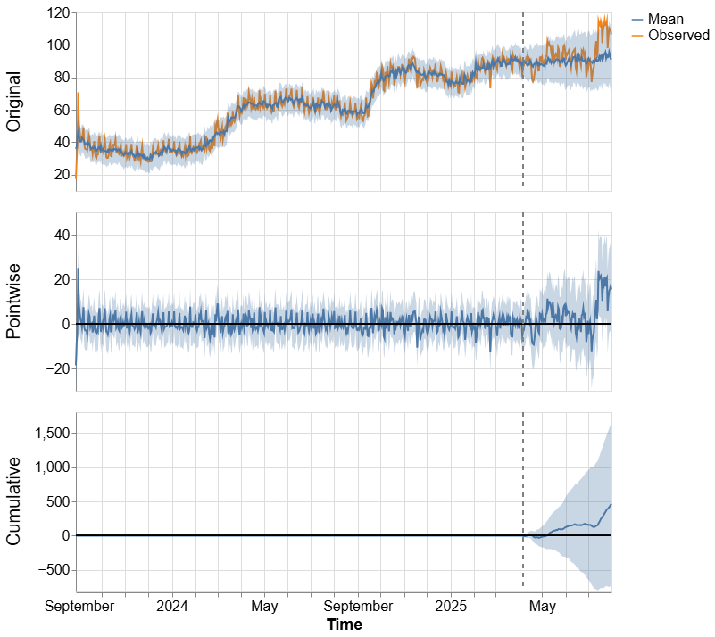

*Figure: Causal impact analysis showing observed vs predicted Aerodrome transaction counts with pointwise and cumulative effects*

```
Posterior Inference {CausalImpact}
                          Average            Cumulative
Actual                    94.2               11017.8
Prediction (s.d.)         89.9 (5.24)        10516.4 (613.0)
95% CI                    [79.5, 100.2]      [9302.8, 11721.0]


Absolute effect (s.d.)    4.3 (5.24)         501.4 (613.0)
95% CI                    [-6.0, 14.7]       [-703.2, 1715.0]


Relative effect (s.d.)    5.1% (6.2%)        5.1% (6.0%)
95% CI                    [-6.0%, 18.4%]     [-6.0%, 18.4%]


Posterior tail-area probability p: 0.218
Posterior prob. of a causal effect: 78.25%
```


**Model Quality:**
- Pre-period RMSE: 3.38
- Pre-period R²: 0.97


**Interpretation:**
- The observed average was 94.2 on transformed scale
- The model predicted 89.9 on transformed scale in absence of funding
- Estimated effect: +4.3 on transformed scale (+5.1%)
- **p-value: 0.218** - Not statistically significant
- The 95% confidence interval [-6.0, 14.7] includes negative effects, indicating high uncertainty
- Posterior probability of a causal effect: 78.25%
- Note: Since these values are Box-Cox transformed, the 5.1% relative effect represents the approximate percentage increase in the original transaction metric

#### Model Diagnostics

**Residual Analysis (Box-Cox Model):**

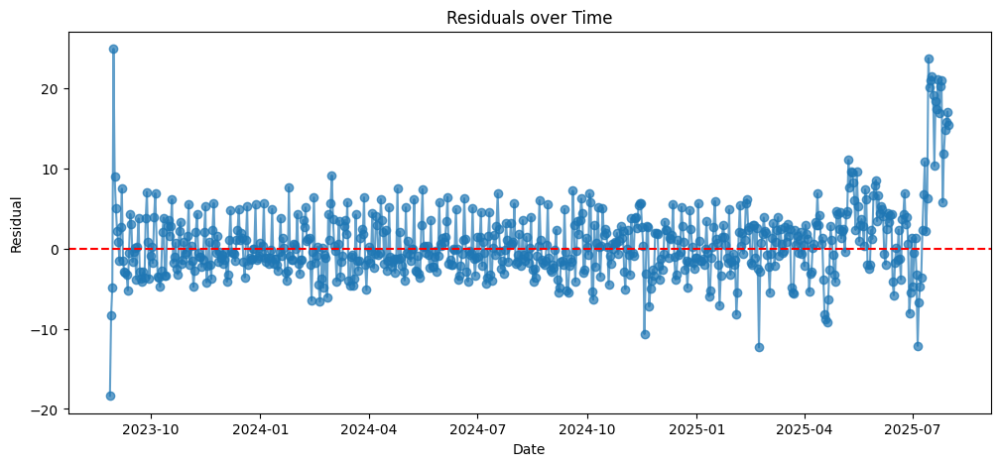


*Figure: Model diagnostics for Aerodrome showing residuals over time (top) and autocorrelation function of residuals (bottom)*

- **Shapiro-Wilk test**: statistic = 0.89, p < 0.0001 (residuals not normally distributed)
- **Durbin-Watson statistic**: 0.77 (positive autocorrelation present)

**Pre-period vs Post-period Residuals:**

Pre-period:
- Shapiro-Wilk: 0.95, p<0.0001 (mild non-normality)
- Durbin-Watson: 1.41 (moderate autocorrelation)

Post-period:
- Shapiro-Wilk: 0.95, p<0.0005 (similar non-normality)
- Durbin-Watson: 0.26 (severe autocorrelation)

**Interpretation:**
Similar to Uniswap, the post-period shows deteriorated model fit with severe autocorrelation (0.26), suggesting the model struggles to capture time-related patterns after funding. However, residual normality remains more stable across periods compared to Uniswap.


---


### 4.3 Velodrome Analysis


Following the same methodology for Velodrome:

**Pre-treatment correlations Analysis:**

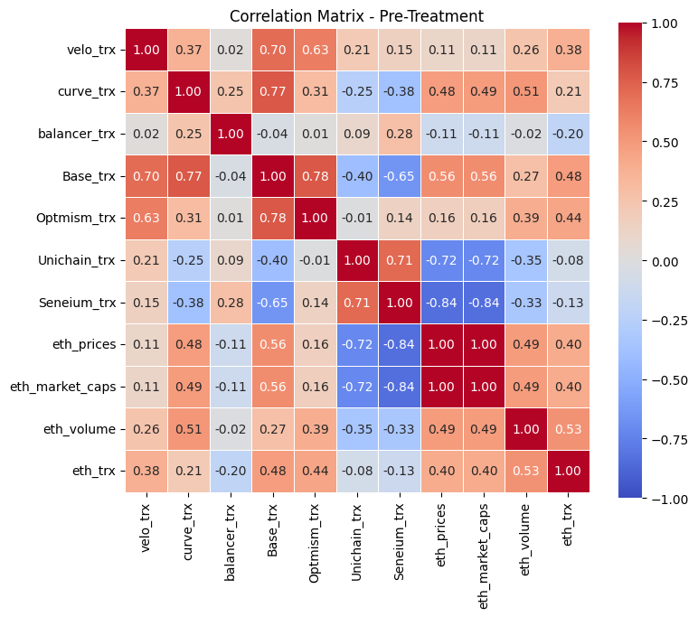

*Figure: Correlation matrix showing relationships between Velodrome and various metrics before treatment*


- Base: 0.70
- Optimism: 0.63
- ETH transactions: 0.38
- Curve: 0.37

**Beta Coefficients (Initial Model Fit):**

| Predictor | Mean β | 95% CI | P(β>0) | P(β<0) |
|-----------|--------|--------|--------|--------|
| Base transactions | 0.3205 | [0.2296, 0.4179] | 100% | 0% |
| Optimism transactions | 0.0886 | [0.0000, 0.1397] | 92.2% | 0% |
| Curve transactions | 0.1195 | [0.0000, 0.4824] | 43.2% | 0.3% |
| ETH transactions | -0.0007 | [0.0000, 0.0000] | 0.2% | 1.4% |

**Key Findings:**
- Base transactions show strong predictive power (P(β>0) = 100%)
- Optimism transactions demonstrate moderate predictive strength (P(β>0) = 92.2%)
- Curve and ETH transactions show weak or negligible predictive power, with high uncertainty
- ETH transactions variable was discarted from the final model fit 


**Causal Impact Results:**

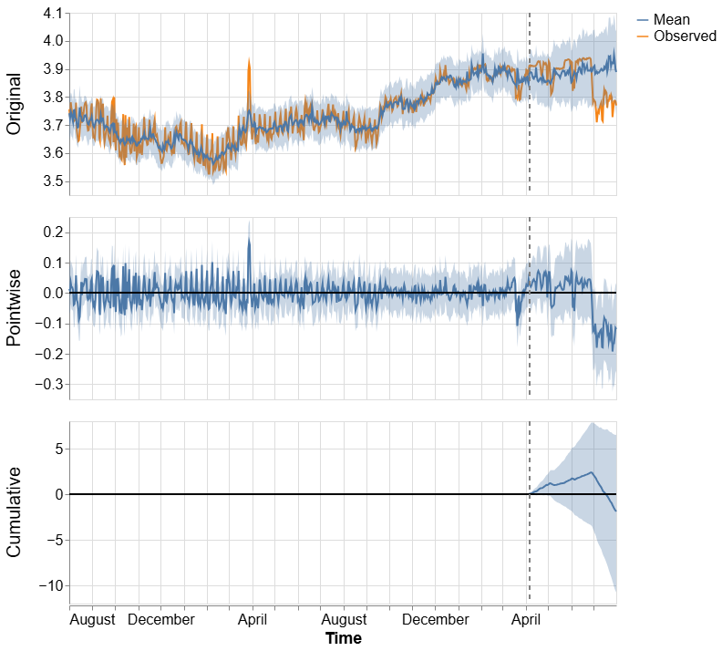

*Figure: Causal impact analysis showing observed vs predicted Velodrome transaction counts with pointwise and cumulative effects*

```
Posterior Inference {CausalImpact}
                          Average            Cumulative
Actual                    3.9                452.9
Prediction (s.d.)         3.9 (0.04)         454.5 (5.08)
95% CI                    [3.8, 4.0]         [444.5, 464.6]

Absolute effect (s.d.)    -0.0 (0.04)        -1.6 (5.08)
95% CI                    [-0.1, 0.1]        [-11.7, 8.4]

Relative effect (s.d.)    -0.3% (1.1%)       -0.3% (1.0%)
95% CI                    [-2.5%, 1.9%]      [-2.5%, 1.9%]

Posterior tail-area probability p: 0.358
Posterior prob. of a causal effect: 64.15%
```


**Model Quality:**
- Pre-period RMSE: 0.032
- Pre-period R²: 0.887


**Interpretation:**
- The observed average was 3.9 on transformed scale
- The model predicted 3.9 on transformed scale in absence of funding
- Estimated effect: -0.0 on transformed scale (-0.3%)
- **p-value: 0.358** - Not statistically significant
- The 95% confidence interval [-0.1, 0.1] includes both negative and positive effects, indicating high uncertainty
- Posterior probability of a causal effect: 64.15%
- Note: Since these values are Box-Cox transformed, the -0.3% relative effect represents the approximate percentage change in the original transaction metric

#### Model Diagnostics

**Residual Analysis (Box-Cox Model):**

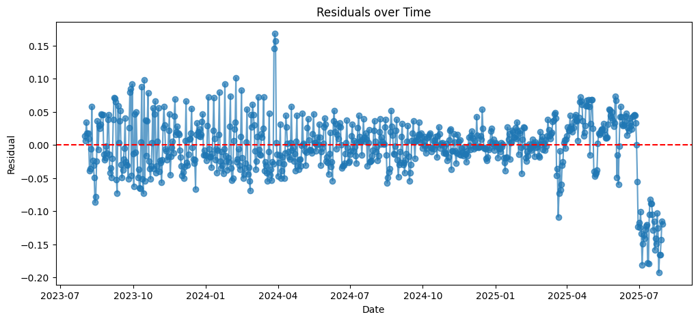

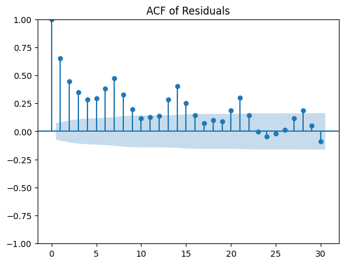

*Figure: Model diagnostics for Velodrome showing residuals over time (top) and autocorrelation function of residuals (bottom)*

- **Shapiro-Wilk test**: statistic = 0.91, p < 0.0001 (residuals not normally distributed)
- **Durbin-Watson statistic**: 0.65 (positive autocorrelation present)

**Pre-period vs Post-period Residuals:**

Pre-period:
- Shapiro-Wilk: 0.97, p<0.0001 (mild non-normality)
- Durbin-Watson: 1.33 (moderate autocorrelation)

Post-period:
- Shapiro-Wilk: 0.85, p<0.0001 (worse non-normality)
- Durbin-Watson: 0.11 (severe autocorrelation)

**Interpretation:**
Velodrome shows the most severe post-period model deterioration among all three projects, with Durbin-Watson dropping from 1.33 to 0.11. This extreme autocorrelation suggests the model fails to capture the post-funding dynamics, indicating either a structural break or unmeasured confounders affecting the relationship between predictors and outcome


---
## Findings and Interpretation


### Summary Across All Three Projects


| Project | Estimated Effect | P-value | R² | Significance |
|---------|-----------------|---------|-----|--------------|
| **Uniswap** | +9.1% | 0.202 | 0.99 | No |
| **Aerodrome** | +5.1% | 0.218 | 0.97 | No |
| **Velodrome** | -0.3% | 0.358 | 0.887 | No |


**What These Numbers Mean:**

The **estimated effect** shows the percentage change in transactions we observed compared to what the model predicted would happen without funding. The **p-value** tells us how confident we can be that this effect is real (typically, we need p < 0.05 for statistical significance). **R²** indicates how well our model fits the pre-funding data (closer to 1.0 is better).


**Key Findings:**


1. **No Statistically Significant Effects**
   - All p-values > 0.20 (well above the typical 0.05 threshold for significance)
   - We cannot confidently distinguish funding effects from random noise
   - The 95% confidence intervals for all projects include both negative and positive effects, spanning zero


2. **Mixed Results Across Projects**
   - Uniswap shows a positive effect (+9.1%)
   - Aerodrome shows a positive effect (+5.1%)
   - Velodrome shows a near-zero negative effect (-0.3%)
   - Despite two positive effects, the high uncertainty (wide confidence intervals) means we cannot rule out that these are just random fluctuations


3. **High Model Uncertainty Despite Good Fit**
   - All models achieved strong pre-period fit (R² ranging from 0.89 to 0.99)
   - However, uncertainty in the estimated effects is very large
   - Standard deviations often match or exceed the estimated effects themselves
   - Good historical fit doesn't guarantee accurate counterfactual predictions


4. **Model Diagnostics Reveal Limitations**
   - All three projects showed severe autocorrelation in post-period residuals (Durbin-Watson: 0.11-0.26)
   - This suggests the models failed to capture important time-related patterns after funding began
   - Low Durbin-Watson statistics indicate the model hasn't fully learned the underlying trends or seasonality
   - This can happen when the pre-period (training window) is too short or not representative enough
   - The 8-month pre-period may be insufficient to capture the full range of crypto market dynamics


5. **What This Means (and Doesn't Mean)**


**This DOES NOT mean:**
- The funding had no impact
- The projects didn't benefit from the funding
- The money was wasted


**This DOES mean:**
- Any signal (if present) cannot be distinguished from background noise with our current approach
- Using only external on-chain metrics as predictors is insufficient to build reliable counterfactuals
- The model and data are not adequate to detect the causal effect at this time scale and with these variables


### Why Couldn't We Detect an Effect?


**"Absence of evidence is not evidence of absence"**


There are several plausible explanations for why the analysis didn't yield conclusive results:


1. **Crypto Market Volatility**
   - Transaction counts fluctuate wildly day-to-day
   - External market shocks (ETH price swings, competitor launches, regulatory news) create constant noise
   - The signal-to-noise ratio is very low, making it hard to isolate funding effects
   


2. **Insufficient Counterfactual Variables**
   - Crypto projects in the same ecosystem tend to move together
   - Common shocks (market crashes, upgrades, hype cycles) affect all protocols simultaneously
   - Hard to find truly independent control variables
   - Missing important confounders: developer activity, partnerships, marketing campaigns, and critically — how the funding was actually used (hiring, infrastructure, user incentives, etc.)


3. **Short Time Windows**
   - Only ~8 months of pre-period data to learn patterns
   - Only ~4 months of post-treatment observation
   - Many funding effects take longer to materialize (team growth, product improvements, ecosystem partnerships)
   - Long-term impacts not yet visible in the data


4. **Model Specification Issues**
   - BSTS assumes linear relationships between predictors and outcomes
   - Crypto markets may exhibit multiplicative effects, threshold effects, or network effects
   - The model assumes stable relationships over time, but correlations shifted post-funding
   - Residual diagnostics showed violations of normality and independence assumptions
   - These violations reduce the model's ability to make accurate predictions


5. **Endogeneity & Selection Effects**
   - Projects receiving more funding may have been on different growth trajectories to begin with
   - Projects may have anticipated funding and adjusted their behavior beforehand


6. **Measurement Limitations**
   - Transaction count is an imperfect proxy for "impact"

---


## Discussion: Challenges & Learnings


### Technical Challenges


**1. Data Limitations**
- Limited to 8-month pre-period instead of desired 2+ years (mostly because projects themselves were very nascent)
- Missing historical data for newer chains


**2. Counterfactual Selection**
- High correlations in pre-period don't guarantee stable relationships over time
- Risk of including "colliders" that distort causal relationships


**3. Model Specification Issues**
- Crypto data exhibits strong non-stationarity: trends, seasonality, and volatility
- Transformations helped but residual autocorrelation persisted
- BSTS assumes linear relationships, but crypto markets may have multiplicative or network effects
- Used default non-informative priors (more careful calibration could improve results)


---


### Future Directions


These directions aim to move us closer to answering the two guiding questions above by improving effect identification (question 1) and enabling more meaningful ROI assessment (question 2).

To improve this type of analysis of mesuring increase of decrease of activity by measuing transactions, future iterations  could explore:

**1. Richer Data Sources**
- **Off-chain metrics**: GitHub activity, marketing and incentive campaign data
- **Qualitative data**: Project roadmaps, team changes, partnership announcements, technical innovations 
- **Competitive dynamics**: Market share, relative positioning


**2. Alternative Modeling Approaches**

- **Difference-in-Differences**: Compare funded vs unfunded similar projects
- **Machine Learning**: Random forests, gradient boosting for non-linear relationships
- **Causal Discovery**: Learn causal graph structure from data (e.g., PC algorithm, LiNGAM)


**3. Longer Time Horizons**
- Extend pre-period to 2+ years for better baseline
- Wait 6-12 months post-funding for effects to materialize
- Track cohort effects across multiple funding rounds


**4. Alternative Aggregation Strategies**

This analysis employed a **bottom-up approach**: analyzing each funded project individually, then summing results to understand aggregate impact. While this provides granular insights into specific projects, it faces systematic limitations:

**Scalability challenges:**
- Each project requires manual research to identify and validate suitable counterfactual series
- This approach doesn't scale well to analyzing hundreds of funded projects
- Labor-intensive process limits how many projects can be rigorously evaluated

**Counterfactual availability problem:**
- As more projects receive funding over successive rounds, the pool of unfunded similar projects shrinks
- Eventually, we may run out of good counterfactual candidates if most projects in a category receive funding
- This creates a long-term sustainability issue for the bottom-up methodology

A **top-down approach** — aggregating all funded projects into a single time series and analyzing the collective impact — remains unexplored but could offer complementary insights:
- **Potential advantages**: Better signal-to-noise ratio, captures spillover effects, scales easily, doesn't require project-specific counterfactuals
- **Potential disadvantages**: Loses project-specific nuances, harder to attribute success/failure, assumes homogeneous treatment effects

Future work should explore both approaches systematically and investigate whether aggregation level affects conclusions about funding effectiveness.


### ROI considerations (simple break-even execise)


Although we did not establish a causal effect statistically, we can still explore research question (2) — ROI — with a simple break‑even exercise.

To understand whether funding generates positive ROI for the Superchain, we can work backwards from sequencer fees. Using [Optimism's reported median gas fee](https://x.com/Optimism/status/1968352499192209749) of $0.0014 per transaction from August 2024:

**For Uniswap (received ~$296,250 USD):**

- **Transactions needed to break even**: $296,250 ÷ $0.0014 = ~211.6 million transactions
- **Actual transactions** (Jan 1 - July 31, 2025, per official data used for rewards): 102,500,491 transactions
- **This represents 48%** of the transactions needed to recoup the funding through sequencer fees alone

Even if we assume the funding caused a significant transaction increase (say, +9.1% as suggested by our Uniswap model's point estimate), the additional ~9.3 million transactions would generate only ~$13,000 in sequencer fees over the 4‑month post‑funding period.

**At current fee levels, it would take approximately 6 months to break even** on this single grant through direct sequencer fee revenue, assuming transaction levels remain constant.

**Critical limitations of this calculation (sequencer‑fee‑only):**

- **Post‑Dencun economics**: Sequencer fees dropped dramatically after the Dencun upgrade, making them a poor metric for value capture. Pre‑upgrade economics were fundamentally different.

- **Indirect value not measured**:
  - **Ecosystem strength**: Having Uniswap (and similar major protocols) deployed strengthens the entire Superchain's legitimacy and user confidence
  - **Developer attraction**: Top protocols attract more developers and projects to build on the ecosystem
  - **Network effects**: More protocols → more users → more activity → more value (multiplicative, not additive)
  - **Long‑term infrastructure**: Public goods benefits that compound over years, not months
  - **Competitive positioning**: Prevents talented teams from building exclusively on competing chains

- **Alternative Counterfactual question**: Would Uniswap have maintained the same level of Superchain activity without funding? The question isn't whether fees exceed funding, but whether funding changed behavior meaningfully.

**A more holistic ROI view should consider:**
- Total Value Locked (TVL) growth across the ecosystem
- Developer mindshare and talent retention
- Market share vs competing L2 ecosystems
- Protocol innovation and technical improvements
- User acquisition and retention at the ecosystem level
- Long‑term sustainability and resilience of public goods infrastructure


Future iterations could incorporate these holistic ecosystem metrics to refine the definition of positive impact, construct a transparent composite impact index, and improve ROI assessment by quantifying indirect ecosystem value (e.g., developer mindshare, network effects) alongside sequencer‑fee revenue in the post‑Dencun regime. Any definition of "impact" should be co‑developed with round managers and the community to align with program goals and shared norms.


---


## Invitation for Collaboration


This analysis represents a first attempt at quantifying the causal effects of public goods funding on Optimism using open on-chain data. **The results are not conclusive**—and that's okay. Science progresses through exploration, learning from what doesn't work, and iterating.


The inconclusive findings highlight the need for collective work in defining:
- **Better data**: What metrics truly capture public goods impact?
- **Richer models**: How can we account for network effects, non-linearities, and complex dynamics?
- **Shared methodologies**: Can we develop standardized approaches for the broader ecosystem?
- **Realistic expectations**: What can and can't we measure with current methods?


### I'm Sharing This Work Openly


- **Notebook**: [Link to analysis.ipynb](../notebooks/analysis.ipynb)
- **Data pipeline**: [Link to getting_data.ipynb](../notebooks/getting_data.ipynb)
- **Raw data**: Available in the repository


### I Would Love Feedback On:

1. **Methodology**
   - Are there better causal inference approaches for this setting?
   - What am I missing in counterfactual selection?
   - How can I better handle non-stationary crypto data?


2. **Bottom-Up vs Top-Down Analysis**
   - Should I pivot to an aggregated analysis approach instead of individual project assessment?
   - How would you design an aggregated analysis that combines all funded projects?
   - Are there hybrid approaches that could leverage strengths of both methods?


3. **Data**
   - What additional variables would strengthen the analysis?
   - How can we incorporate qualitative information?

### Connect With Me


This work is part of my broader effort to help advance funding mechanisms toward **recurrent and concurrent systems** that can sustainably support public goods. Read more about this vision in [my initial article](https://mirror.xyz/stefipereira.eth/SNXPcTKTO88BGgctU_eJw5_N_q6Tw23q4ed1zGBdCHo).


If you're working on:
- Causal inference in crypto/web3
- Impact measurement for public goods
- Optimism RetroPGF
- Mechanism design for funding systems


**Let's collaborate!** Together we can refine how we measure success for the public goods we build.


---


## Acknowledgments


- **Optimism Foundation** for the RetroPGF program and open data
- **[Carl Cervone](https://x.com/carl_cervone)** and **[Open Source Observer](https://www.oso.xyz/)** for initial feedback, guidance on data gathering, and providing comprehensive on-chain metrics
- **[Impact Evaluation Research Retreat](https://www.researchretreat.org/)** for being the space that ignited the start of this broader research initiative
- **Mariana Azevedo**, economist, for valuable feedback on the approach and general research
- **TensorFlow Probability** team for the CausalImpact implementation
- The broader **crypto impact measurement community** exploring these challenging questions


---


## Appendix


### Technical Specifications


**Software & Packages:**
- Python 3.11
- TensorFlow 2.20.0
- TensorFlow Probability causalimpact 0.2.0
- pandas, numpy, scipy, statsmodels, seaborn, matplotlib


**Model Parameters:**
- BSTS with default priors
- Bayesian inference via MCMC sampling
- 95% credible intervals
- Posterior predictive distributions for counterfactual


**Pre/Post Windows:**
- Pre-period: 2023-08-01 to 2025-04-05 (613 days)
- Post-period: 2025-04-06 to 2025-07-31 (117 days)


### Data Access


All data and analysis code is available in the project repository:
- Analysis notebook: `notebooks/analysis.ipynb`
- Data collection: `notebooks/getting_data.ipynb`
- Aggregated funding data: `notebooks/onchain_builders_aggregated.csv`


### Glossary


- **BSTS**: Bayesian Structural Time Series
- **Counterfactual**: The hypothetical outcome if the intervention (funding) had not occurred
- **p-value**: Probability of observing the data (or more extreme) if there were truly no effect
- **R²**: Proportion of variance explained by the model (0 to 1)
- **RMSE**: Root Mean Squared Error, average prediction error magnitude
- **Box-Cox**: Power transformation to stabilize variance and normalize data
- **Durbin-Watson**: Test statistic for autocorrelation (ideal ≈ 2)
- **Shapiro-Wilk**: Test for normality of residuals


---


## References


1. Brodersen, K. H., et al. (2015). "Inferring causal impact using Bayesian structural time-series models." *Annals of Applied Statistics*, 9(1), 247-274.


2. Google. "TensorFlow Probability CausalImpact." [https://github.com/google/tfp-causalimpact](https://github.com/google/tfp-causalimpact)


3. Open Source Observer (OSO). [https://www.opensource.observer/](https://www.opensource.observer/)


4. Optimism RetroPGF. [https://gov.optimism.io/t/season-7-retro-funding-early-evidence-on-onchain-builders-impact/10163](https://gov.optimism.io/t/season-7-retro-funding-early-evidence-on-onchain-builders-impact/10163)


5. Initial article on advancing funding mechanisms: [https://mirror.xyz/stefipereira.eth/SNXPcTKTO88BGgctU_eJw5_N_q6Tw23q4ed1zGBdCHo](https://mirror.xyz/stefipereira.eth/SNXPcTKTO88BGgctU_eJw5_N_q6Tw23q4ed1zGBdCHo)


---


*This article reflects exploratory research conducted in September-October 2025. Methods and conclusions are offered in the spirit of open science and collaborative learning.*


**License**: This work is shared under [CC BY-SA 4.0](https://creativecommons.org/licenses/by-sa/4.0/) - feel free to build upon it with attribution.


