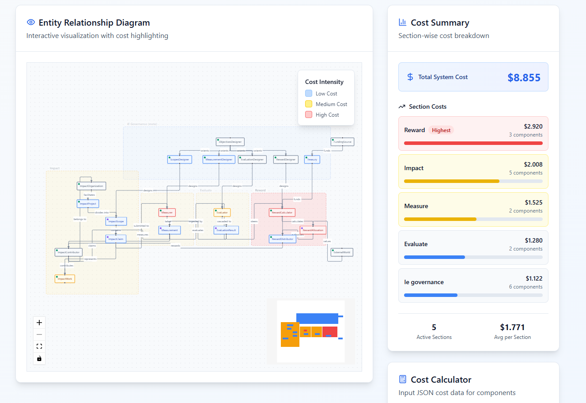

# Impact Evaluator Calculator (IEC)

# Live at [Impact Evaluator Calculator](https://automated-retrofunding-tooling.onrender.com/)
## Overview
The Impact Evaluator Calculator is a sophisticated tool designed to help Impact Evaluation (IE) managers analyze and simulate the costs of running different IE designs. This interactive web application provides a visual and intuitive interface for calculating, analyzing, and optimizing the costs associated with Impact Evaluation projects.  

## Key Features
- **Interactive ERD Visualization**: Visual representation of your IE design components with cost highlighting
- **Real-time Cost Calculation**: Instantly see how design changes affect your total system cost
- **Component-based Cost Analysis**: Break down costs by individual components and sections
- **Cost Simulation**: Experiment with different IE designs and see cost implications immediately
- **Visual Cost Summary**: Clear visualization of cost distribution across your IE components

## Getting Started

### Prerequisites
- Node.js (v14 or higher)
- npm (Node Package Manager)

### Installation
1. Clone the repository
2. Navigate to the project directory:
```bash
cd ImpactEvaluatorCalculator/site/project
```
3. Install dependencies:
```bash
npm install
```
4. Start the development server:
```bash
npm run dev
```

## Usage Guide

### 1. Main Dashboard
The main interface consists of three primary sections:
- Entity Relationship Diagram (ERD)
- Cost Summary Panel
- Cost Calculator

### 2. ERD Visualization
- Interactive diagram showing your IE design components
- Components are color-coded based on their cost intensity
- Hover over components to see detailed cost breakdowns

### 3. Cost Calculator
- Toggle the calculator using the "Show Calculator" button
- Input cost data for each component:
  - Total hours
  - Hourly rates
  - Direct costs
- Costs are automatically calculated and updated in real-time

### 4. Cost Summary
- View total system cost
- Breakdown of costs by section
- Component-level cost details
- Export cost reports for documentation

## Benefits for IE Managers

### Cost Analysis
- Understand the full financial implications of your IE design
- Identify cost-intensive components
- Make data-driven decisions about resource allocation

### Design Optimization
- Simulate different IE configurations
- Compare costs across different design options
- Optimize resource distribution

### Resource Planning
- Plan budget allocation effectively
- Identify potential cost-saving opportunities
- Make informed decisions about staffing and resource requirements

## Best Practices
1. Start with a basic IE design and add components incrementally
2. Use the visual feedback to identify cost hotspots
3. Document different design iterations and their associated costs
4. Consider both short-term and long-term cost implications
5. Regular review and adjustment of cost assumptions

## Support
For technical support or feature requests, please create an issue in the repository.

## Contributing
Contributions are welcome! Please read our contributing guidelines for details on how to submit pull requests.

## License
[Add your license information here]
